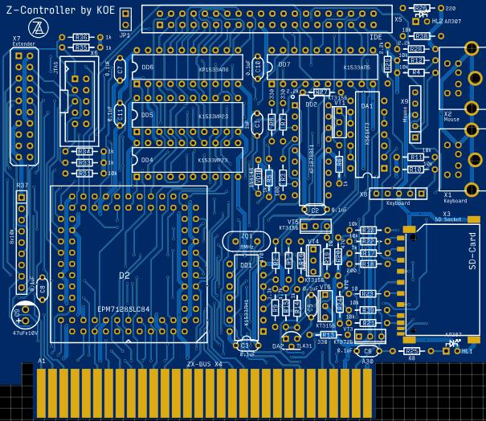

# Z-Controller by KOE

Контроллер PS/2 мышки и клавиатуры (no WAIT), IDE и SPI интерфейсов для ZX-Spectrum-совместимых компьютеров, оснащенных периферийной шиной ZX-BUS.

Плата и схема, востановленные по сканам оригинальной печатной платы, предоставленными  Михаилом Андреевым (Mikka_A) и документации.

Более подробную документацию можно найти на странице http://pentagon.nedopc.com/info.htm.
Баг печатной платы, описанный в документации, исправлен.

[Принципиальная схема](Export/Schematic_Z-Controller_v1.0.0.pdf)

[Монтажная схема](Export/PCB_Z-Controller_v1.0.0.pdf)

[Чат Scorpion ZS & Ленинград в Telegram](https://t.me/zs_scorpion)
